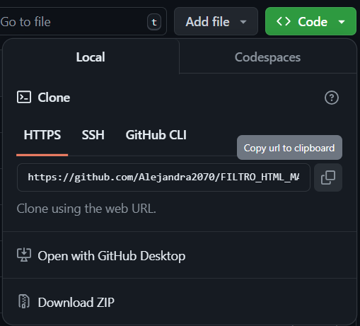

# FILTRO HTML Y CSS
Se realizó la maquetación del filtro asignado en clase.

# Descripción

Este aplicativo consta de varias secciones las cuales son:

- >Una página donde podrás encontrar todos los productos.
- >Tres páginas más que están divididas en: Abrigos, Pantalones y Camisetas.
- >Una última página donde encuentras el carrito de compras.
# Tecnologías utilizadas
- >HTML5
- >CSS
# Estructura del proyecto

>Como podrás observar tenemos una carpeta de imágenes, varios archivos [index.html], [style.css] y un archivo [readme.md] que fueron utilizados para la realización del proyecto conteniendo el código, estilos y las imágenes.

# Características
| Nombre | Descripción |
|--|--|
| Archivos [index.html] | Estos contienen el código principal. |
| Archivos [style.css] | Estos nos permiten realizar el diseño de las páginas. |
| Archivo [readme] | El cual contiene toda la información importante realizada en el código y CSS. |
| Carpeta [imagenes] | Esta carpeta contiene las imágenes utilizadas en el proyecto. |

# Diseño

- Se utilizó posicionamiento absoluto y relativo para la mayoría de los elementos.

- Se crearon menús desplegables.

# Instrucciones
1. Copiar el enlace del repositorio.

2. Clonar el repositorio cargado en GitHub.

3. Abrir en la nube uno de los archivos index.html en un navegador web.

# Desarrollado por:
El proyecto fue desarrollado por Alejandra Machuca Molina estudiante de CampusLands como trabajo de filtro de los módulos Html y CSS.